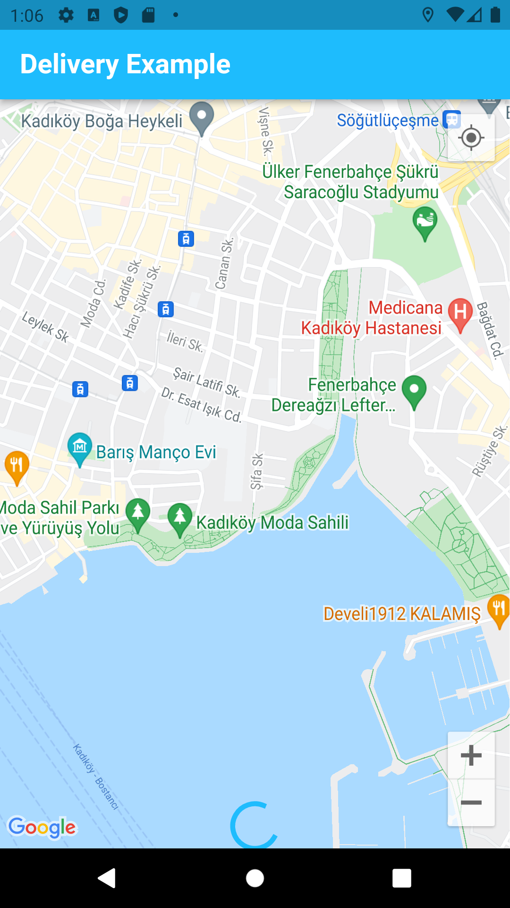
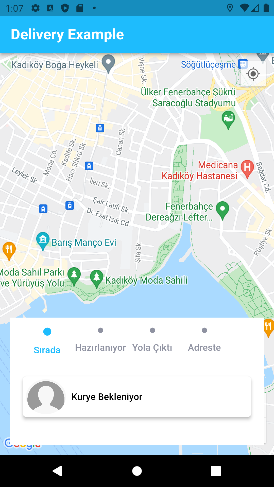
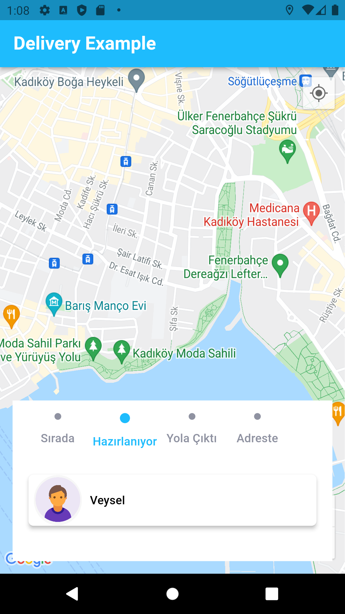
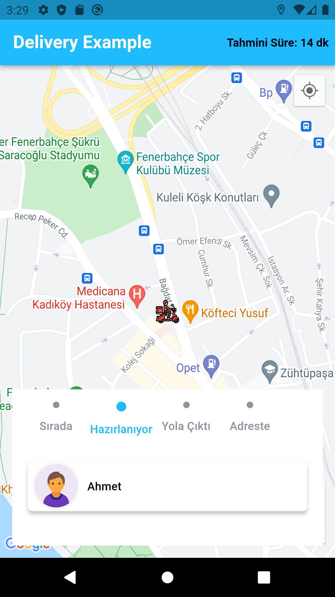
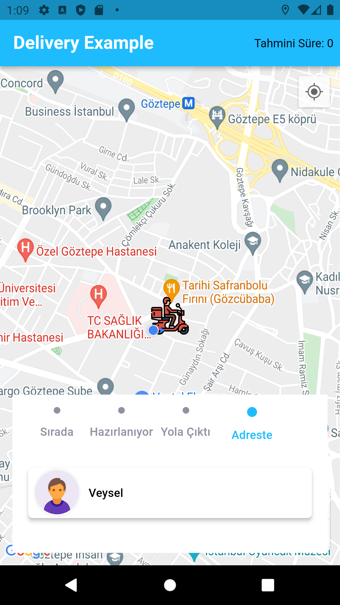

# flutter_google_maps

### Google Maps Api ve websocket kullanımı ile sipariş uygulaması örneği yaptım

State Management olarak Provider paketi kullanıldı

## Getting Started

uygulamanın çalışabilmesi için [pusher.com ](https://pusher.com/)'dan appKey almanız gerekir.

#### Uygulama açıldığında;

- location izni istenir
- maps_view sayfasında, location_service sayfasında bulunan getPermission methodu çağırılır
- maps_view sayfası ekrana gelir
- Maps üzerinde bulunan marker Image'ı setlenir

- pusher_service sayfasından, Status ve Location olmak üzere 2 tane event dinlenir

#### Status eventinde olay akışı şu şekilde olur;

channel.bind() methodun'dan her event geldiğinde;

- Stream tipinde oluşturduğum statusController'a bu event mesajı aktarılır
- maps_view sayfasında StatusStreamBuilder widgetı ile event mesajı dinlenir
- StatusStreamBuilder widgetı ile de DeliveryStatusCardWidget'ına Stream den gelen datayı yollar
- LoadingCenter widget'ının yerine, bu widget ekranda oluşturulur
- ayrıca map_view_model sayfasında bulunan changeStatusListIndex methodu tetiklenir
- (view tarafında bu index e eşit olan circle mavi rengi alır, status'ün durumu belli olur)

#### Location eventinde olay akışı şu şekilde olur;

- Stream tipinde oluşturduğum locationController'a bu event mesajı aktarılır
- maps_view sayfasında LocationStreamBuilder widgetı ile event mesajı dinlenir
- Ekranın üst kısmında olan Tahmini Süre bilgisi ekrana gelir
- ayrıca map_view_model sayfasında bulunan updateMarkerLatLng methodu tetiklenir
- view tarafında CustomGoogleMaps widgetındaki marker değeri güncellenir, Maps üzerindeki Marker'ın yer değiştirmesi sağlanır

## Olay Akışı:

Pusher Event => StreamController => StreamBuilder => DeliveryStatusCardWidget(data yı alır) => Ekranı oluşturur

### Status Eventi json örneği

Channel: order-1001,
Event: status-update

      {
       "status":"Hazırlanıyor",
       "rider":"Ahmet"
      }

### Location Eventi json örneği

Channel: order-1001,
Event: location-update

      {
        "latitude": 40.973488,
        "longitude": 29.039739,
        "estimated": 5
       }

### Screenshots

<table>
   <thead>
      <tr>
         <th></th>
         <th></th>
      </tr>
   </thead>
   <tbody>
      <tr>
         <td></td>
         <td></td>
      </tr>
       <tr>
         <td></td>
         <td></td>
      </tr>
        <tr>
         <td></td>
      </tr>
   </tbody>
</table>
